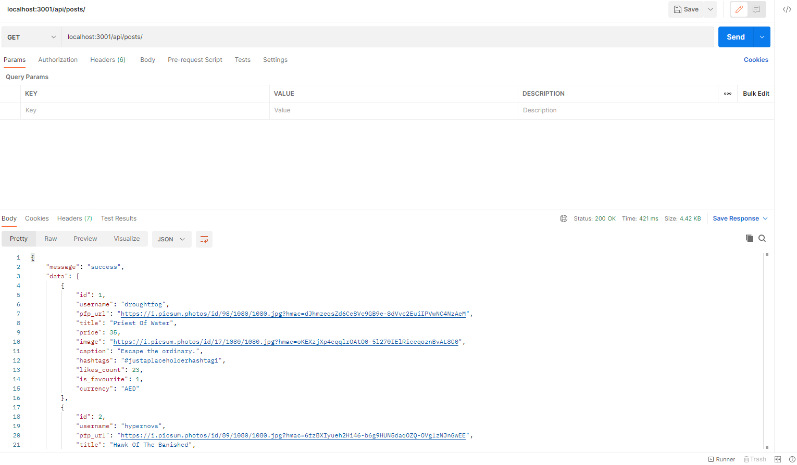

# How I built Noon Backend REST API with Node.js, SQLite, and Express.js.

The main components of this REST API are:
* A Node.js based project created as an NPM module
* An Express.js web server to manage the API endpoints, requests and responses
* An SQLite database for application storage

## Why did I use SQLite?
To keep things simple in the interest of time.

## Packages used
- [express](https://www.npmjs.com/package/express)
- [body-parser](https://www.npmjs.com/package/body-parser)
- [sqlite3](https://www.npmjs.com/package/sqlite3)

## Steps
1. Created a new project folder and an empty NPM project.
```
mkdir noon-backend && cd noon-backend
npm init
```

2. Installed the required dependencies for this project.
```
npm install express sqlite3 body-parser
```

3. Initiated Git and created a .gitignore file to ignore the node_modules folder and SQLite database that the API will create.
```
git init
echo -e "node_modules\ndb.sqlite" > .gitignore
```

4. Created the main server script index.js using Express.js.
```
// Create express app
const express = require("express");
const app = express();

// Root endpoint
app.get("/", (request, response) => {
  response.json({ message: "ok" });
});

// TODO: Insert API endpoints

// Default response for other requests
app.use(function (request, response) {
  response.status(404);
});

// Server port
const port = process.env.PORT || 3001;
app.listen(port, () => console.log(`Listening on port ${port}...`));
```js

5. Added a new "start" entry in the package.json file to run the server using the `npm start` command:
```
"scripts": {
    "start": "node index.js",
    "test": "echo \"Error: no test specified\" && exit 1"
  },
  
```js

6. Created a new file database.js for the local database to store information consumed by the REST API. This creates the primary database connection and its initialisation.

```
// Initialise SQLite
var sqlite3 = require("sqlite3").verbose();

const DBSOURCE = "db.sqlite";

let db = new sqlite3.Database(DBSOURCE, (error) => {
  if (error) {
    // Show database connection error in console
    console.error(error.message);
    throw error;
  } else {
    console.log("Connected to the SQLite database.");
    // Create posts table and feed fake data
    db.run(
      `CREATE TABLE posts (
            id INTEGER PRIMARY KEY AUTOINCREMENT,
            username TEXT NOT NULL,
            pfp_url TEXT NOT NULL,
            title TEXT NOT NULL,
            price REAL NOT NULL,
            image TEXT NOT NULL,
            caption TEXT NOT NULL,
            hashtags TEXT NOT NULL,
            likes_count INTEGER NOT NULL,
            is_favourite INTEGER NOT NULL,
            currency TEXT NOT NULL
        );`,
      (error) => {
        if (!error) {
          var insert =
            "INSERT INTO posts (id, username, pfp_url, title, price, image, caption, hashtags, likes_count, is_favourite, currency) VALUES (?,?,?,?,?,?,?,?,?,?,?)";
          db.run(insert, [
            1,
            "droughtfog",
            "https://i.picsum.photos/id/98/1080/1080.jpg?hmac=dJhmzeqsZd6CeSVc9GB9e-8dVvc2EuiIPVwNC4NzAeM",
            "Priest Of Water",
            35.0,
            "https://i.picsum.photos/id/17/1080/1080.jpg?hmac=oKEXzjXp4cqqlrOAtO0-5l270IElRiceqoznBvAL8G0",
            "Escape the ordinary.",
            "#justaplaceholderhashtag1",
            23,
            1,
            "AED",
          ]);
          db.run(insert, [
            2,
            "hypernova",
            "https://i.picsum.photos/id/89/1080/1080.jpg?hmac=6fzBXIyueh2Hi46-b6g9HUN5daqOZQ-OVglzNJnGwEE",
            "Hawk Of The Banished",
            20.0,
            "https://i.picsum.photos/id/100/1080/1080.jpg?hmac=mWDGUigfU4ngd8DDoA6Hw_NFjk6mEh-X-uDRAXCXC58",
            "Be you. do you for you.",
            "#justaplaceholderhashtag2",
            "6",
            "0",
            "AED",
          ]);
          db.run(insert, [
            3,
            "ratplumnet",
            "https://i.picsum.photos/id/7/1080/1080.jpg?hmac=fUDbr86W3sAtziTx2f04tx3natHzJ4Boy_xep7FgfRQ",
            "Humans Of The East",
            15.0,
            "https://i.picsum.photos/id/1000/1080/1080.jpg?hmac=84X75Jw5QZimZ3c2p6npDAMX_z6U8-VarJGXo4FruRs",
            "One advantage of talking to yourself is that you know at least somebody's listening.",
            "#justaplaceholderhashtag3",
            90,
            1,
            "AED",
          ]);
          db.run(insert, [
            4,
            "voyager2",
            "https://i.picsum.photos/id/777/1080/1080.jpg?hmac=XzSm0mmpjf4r-H65K8xcb8HDIMNxGF5VgZx5Ga9aGn8",
            "Cats Without Faith",
            50.0,
            "https://i.picsum.photos/id/8/1080/1080.jpg?hmac=LFjuLaZt7wzkxAo_PMQJ0uqeT6nNL6ikXJLsd1r4rWA",
            "Confidence Level: Selfie with no Filter.",
            "#justaplaceholderhashtag4",
            21,
            0,
            "AED",
          ]);
          db.run(insert, [
            5,
            "fernlizard",
            "https://i.picsum.photos/id/77/1080/1080.jpg?hmac=pDJoYXDQ4YU1bebadvZMjPuetGhV8tDWlK2RwpeGZVw",
            "Giants And Lions",
            40.0,
            "https://i.picsum.photos/id/69/1080/1080.jpg?hmac=9QFRcJF5TGL4kmZAVaCIn7e2Jp3kZzyx8NLRJRUV87w",
            "Always remember that you're unique. Just like everyone else.",
            "#justaplaceholderhashtag5",
            69,
            1,
            "AED",
          ]);
          db.run(insert, [
            6,
            "basscandy",
            "https://i.picsum.photos/id/69/1080/1080.jpg?hmac=9QFRcJF5TGL4kmZAVaCIn7e2Jp3kZzyx8NLRJRUV87w",
            "Boys And Boys",
            43.0,
            "https://i.picsum.photos/id/77/1080/1080.jpg?hmac=pDJoYXDQ4YU1bebadvZMjPuetGhV8tDWlK2RwpeGZVw",
            "We travel not to escape life, but for life not to escape us.",
            "#justaplaceholderhashtag6",
            73,
            0,
            "AED",
          ]);
          db.run(insert, [
            7,
            "icepigeon",
            "https://i.picsum.photos/id/8/1080/1080.jpg?hmac=LFjuLaZt7wzkxAo_PMQJ0uqeT6nNL6ikXJLsd1r4rWA",
            "Moon Of Utopia",
            23.0,
            "https://i.picsum.photos/id/777/1080/1080.jpg?hmac=XzSm0mmpjf4r-H65K8xcb8HDIMNxGF5VgZx5Ga9aGn8",
            "I didn't come here to lose.",
            "#justaplaceholderhashtag7",
            88,
            0,
            "AED",
          ]);
          db.run(insert, [
            8,
            "coffeecake",
            "https://i.picsum.photos/id/1000/1080/1080.jpg?hmac=84X75Jw5QZimZ3c2p6npDAMX_z6U8-VarJGXo4FruRs",
            "Climax Of Insanity",
            54.0,
            "https://i.picsum.photos/id/7/1080/1080.jpg?hmac=fUDbr86W3sAtziTx2f04tx3natHzJ4Boy_xep7FgfRQ",
            "We're limited edition.",
            "#justaplaceholderhashtag8",
            39,
            0,
            "AED",
          ]);
          db.run(insert, [
            9,
            "ngc1569bat",
            "https://i.picsum.photos/id/100/1080/1080.jpg?hmac=mWDGUigfU4ngd8DDoA6Hw_NFjk6mEh-X-uDRAXCXC58",
            "Choking In The Leaders",
            69.0,
            "https://i.picsum.photos/id/89/1080/1080.jpg?hmac=6fzBXIyueh2Hi46-b6g9HUN5daqOZQ-OVglzNJnGwEE",
            "The more you weight the harder you are to kidnap. Stay safe, eat cake.",
            "#justaplaceholderhashtag9",
            66,
            0,
            "AED",
          ]);
          db.run(insert, [
            10,
            "blackeye",
            "https://i.picsum.photos/id/17/1080/1080.jpg?hmac=oKEXzjXp4cqqlrOAtO0-5l270IElRiceqoznBvAL8G0",
            "Destroying The Forest",
            21.0,
            "https://i.picsum.photos/id/98/1080/1080.jpg?hmac=dJhmzeqsZd6CeSVc9GB9e-8dVvc2EuiIPVwNC4NzAeM",
            "Too glam to give a damn.",
            "#justaplaceholderhashtag69",
            3,
            0,
            "AED",
          ]);
        }
      }
    );
  }
});

module.exports = db;
```js

7. Extended the REST API with data endpoints.
```
// Create express app
const express = require("express");
const app = express();
const bodyParser = require("body-parser");
const db = require("./database.js");

// Adding a generic JSON and URL-encoded parser as a top-level middleware, which will parse the bodies of all incoming requests.
// Parse application/x-www-form-urlencoded
app.use(bodyParser.urlencoded({ extended: true }));
// Parse application/json
app.use(bodyParser.json());

// Root endpoint
app.get("/", (request, response) => {
  response.json({ message: "ok" });
});

// Get all posts from the database
app.get("/api/posts", (request, response) => {
  const sql = "SELECT * FROM posts";
  db.all(sql, (error, rows) => {
    if (error) {
      response.status(400).json({ message: "error", error: error.message });
      return;
    }
    response.json({
      message: "success",
      data: rows,
    });
  });
});

// Update is_favourite
app.patch("/api/posts/favourite/:id", (request, response) => {
  const data = {
    id: request.params.id,
    is_favourite: request.body.is_favourite,
  };

  db.run(
    `UPDATE posts SET is_favourite = COALESCE(?,is_favourite) WHERE id = ?`,
    [data.is_favourite, data.id],
    function (error, result) {
      if (error) {
        response
          .status(400)
          .json({ message: "error", error: response.message });
        return;
      }
      response.json({
        message: "success",
        data: data,
      });
    }
  );
});

// Default response for other requests
app.use(function (request, response) {
  response.status(404);
});

// Server port
const port = process.env.PORT || 3001;
app.listen(port, () => console.log(`Listening on port ${port}...`));

```js

8. Tested the REST API via Postman by running the `npm start` command.

```
> noon-backend@1.0.0 start
> node index.js

Listening on port 3001...
Connected to the SQLite database.
```



9. Deployed on [Heroku](https://noon-backend.herokuapp.com/). 